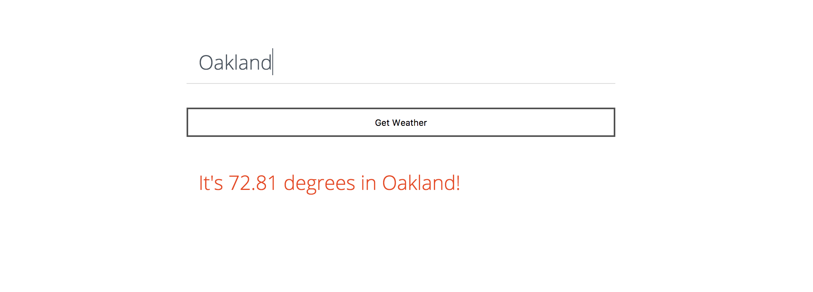

# Simple weather

A simple weather application that takes the name of a city and gives the user that city's current temperature.

## Prerequisites

Node and Node Package Manager must be installed on your local machine

## Installing

* Fork and clone the repository
* Type `npm install` to get the required dependencies

## API Reference

[OpenWeatherMap](https://openweathermap.org/current)